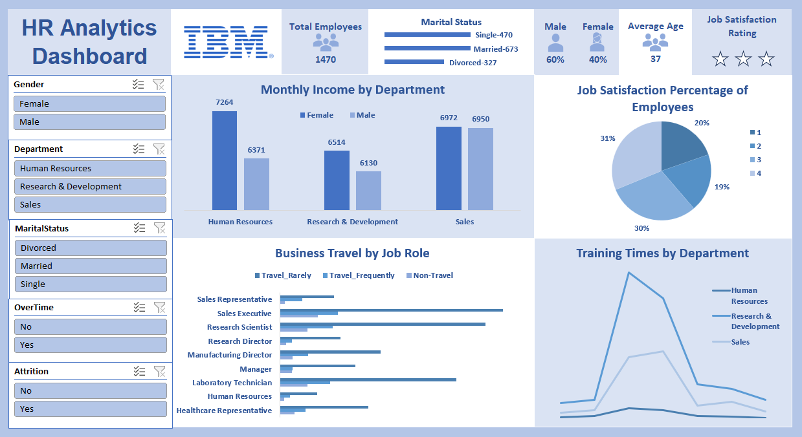

# IBM HR Analytics Dashboard Using Excel 

## Project Overview
- This project showcases an **interactive HR analytics dashboard** created using Microsoft Excel. 
- The dashboard provides insights into key workforce metrics, including employee demographics, job satisfaction, work-life balance, and turnover rates. 
- Designed to support HR professionals and decision-makers, this dashboard enables data-driven strategies to improve organizational efficiency.

## Key Highlights

### Interactive Filters:
- Filter insights dynamically by **gender**, **department**, **overtime status**, **job satisfaction**, **job involvement**, and **attrition**.
- Use slicers to drill down into specific subsets of data for in-depth analysis.

### Visualizations:
1. **Bar Charts**: 
   - Gender distribution, monthly income by department, and business travel patterns by job roles.
2. **Pie Chart**: 
   - Employee job satisfaction levels visualized as percentages.
3. **Line Graph**:
   - Training time trends segmented by departments.
4. **Summary Metrics**:
   - Total employees: **1,470** (60% Male, 40% Female).
   - Job satisfaction: Ratings on a **4-point scale**.
   - Turnover rate: **16%**, segmented by gender and department.

## Focus Areas:
- **Attrition Patterns**: Identify trends in employee turnover by demographics and job roles.
- **Departmental Insights**: Analyze differences in income, training hours, and satisfaction levels across departments.
- **Work-Life Balance**: Understand how marital status influences work-life balance and involvement.

## Purpose
The dashboard aims to:
- **Understand Workforce Trends**: Provide HR professionals with clear, actionable insights.
- **Identify Key Issues**: Pinpoint areas for improvement in employee satisfaction and retention.
- **Drive HR Strategies**: Support informed decision-making to enhance organizational performance.

## Why Excel?
Microsoft Excel is leveraged in this project to:
- Offer **accessibility** to HR teams without advanced technical skills.
- Demonstrate the power of Excel’s **interactive features**, including pivot tables, slicers, and rich visualizations.

## About the Dataset
The dataset includes:
- Employee demographics: **Gender**, **age**, **marital status**.
- Job-related data: **Department**, **job roles**, **monthly income**, **training hours**, **business travel patterns**.
- Satisfaction metrics: **Job satisfaction**, **work-life balance**, **attrition**.

## 💬 Feedback and Discussion
I’d love to hear your thoughts and suggestions! Let’s discuss ways to enhance the dashboard or explore deeper HR analytics insights. Feel free to comment or open issues in this repository. 😊
